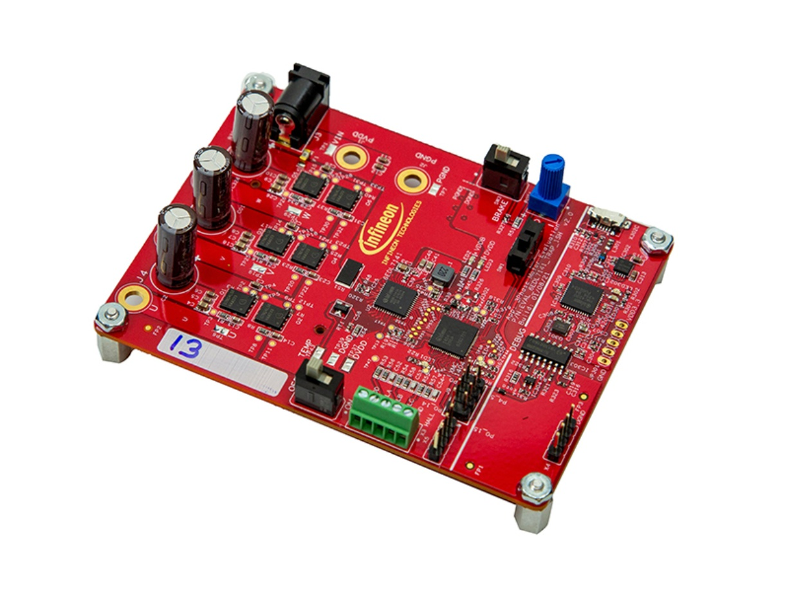

# EVAL_6EDL7141_TRAP_1SH BSP

## Overview

The EVAL_6EDL7141_TRAP_1SH houses the 6EDL7141 three-phase smart motor driver IC with on board debugger.     
**Note:**
Programming this kit requires installing 
[SEGGER J-Link software](https://www.segger.com/downloads/jlink/#J-LinkSoftwareAndDocumentationPack)

To use code from the BSP, simply include a reference to `cybsp.h`.

## Features

### Kit Features:

* 6EDL7141 three-phase smart motor driver IC
* XMC1404 (ARM® Cortex®-M0 based) Microcontroller in a VQFN64 package
* BSC007N04LS6 OptiMOS™ 6 40V 0.7mΩ 5x6PQFN
* On board Debugger for downloading and debugging of application code
* Two used LEDs connected to GPIO P4.7, P4.8
* Speed POT to set speed reference of motor connected to analog input P2.5
* 8-pin XMC™ MCU Debug Connector to external debugger
* 5-pin HALL connector inputs for motor position feedback connected to GPIO P4.1, P4.2, P4.3
* On board temperature sensor connected to analog input P2.4
* Trinamic QBL4208-61-04-013 BLDC motor with three Hall sensors(Depending on ordering option)

### Kit Contents:

* EVAL_6EDL7141_TRAP_1SH 18V brushless DC motor drive board

## BSP Configuration

The BSP has a few hooks that allow its behavior to be configured. Some of these items are enabled by default while others must be explicitly enabled. Items enabled by default are specified in the EVAL_6EDL7141_TRAP_1SH.mk file. The items that are enabled can be changed by creating a custom BSP or by editing the application makefile.

Components:
* Device specific category reference (e.g.: CAT1) - This component, enabled by default, pulls in any device specific code for this board.

Defines:
* CYBSP_WIFI_CAPABLE - This define, disabled by default, causes the BSP to initialize the interface to an onboard wireless chip if it has one.
* CY_USING_HAL - This define, enabled by default, specifies that the HAL is intended to be used by the application. This will cause the BSP to include the applicable header file and to initialize the system level drivers.
* CYBSP_CUSTOM_SYSCLK_PM_CALLBACK - This define, disabled by default, causes the BSP to skip registering its default SysClk Power Management callback, if any, and instead to invoke the application-defined function `cybsp_register_custom_sysclk_pm_callback` to register an application-specific callback.

See the [BSP Setttings][settings] for additional board specific configuration settings.

## API Reference Manual

The EVAL_6EDL7141_TRAP_1SH Board Support Package provides a set of APIs to configure, initialize and use the board resources.

See the [BSP API Reference Manual][api] for the complete list of the provided interfaces.

## More information
* [EVAL_6EDL7141_TRAP_1SH BSP API Reference Manual][api]
* [EVAL_6EDL7141_TRAP_1SH Documentation](https://www.infineon.com/cms/en/product/evaluation-boards/eval_6edl7141_trap_1sh/)
* [Cypress Semiconductor, an Infineon Technologies Company](http://www.cypress.com)
* [Infineon GitHub](https://github.com/infineon)
* [ModusToolbox™](https://www.cypress.com/products/modustoolbox-software-environment)

[api]: https://infineon.github.io/TARGET_EVAL_6EDL7141_TRAP_1SH/html/modules.html
[settings]: https://infineon.github.io/TARGET_EVAL_6EDL7141_TRAP_1SH/html/md_bsp_settings.html

---
© Cypress Semiconductor Corporation (an Infineon company) or an affiliate of Cypress Semiconductor Corporation, 2019-2022.